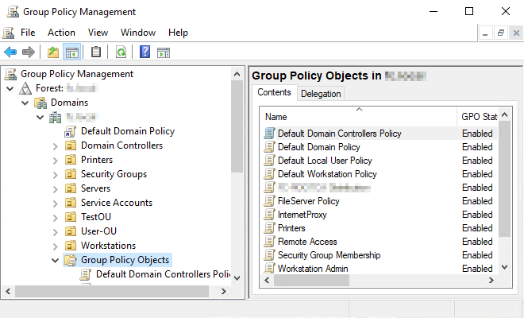
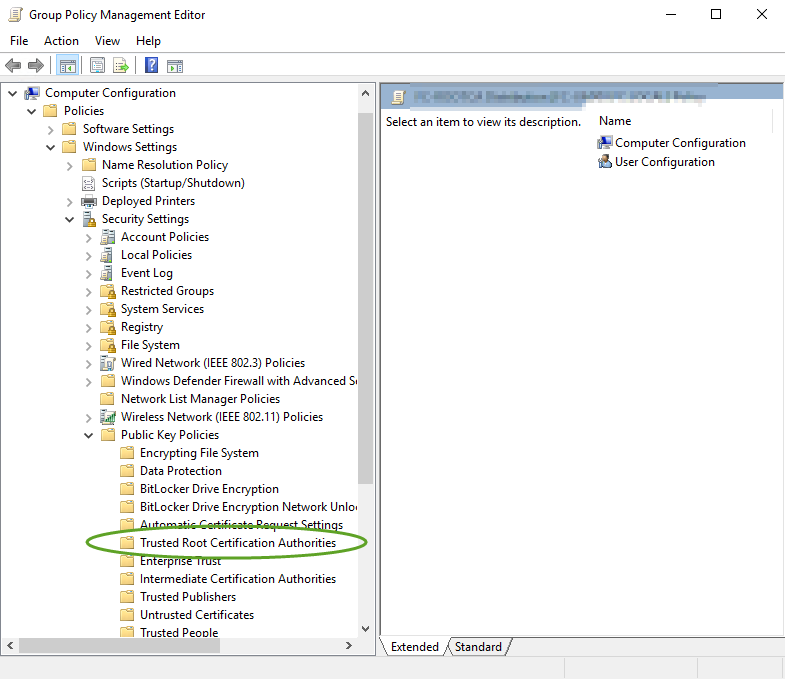
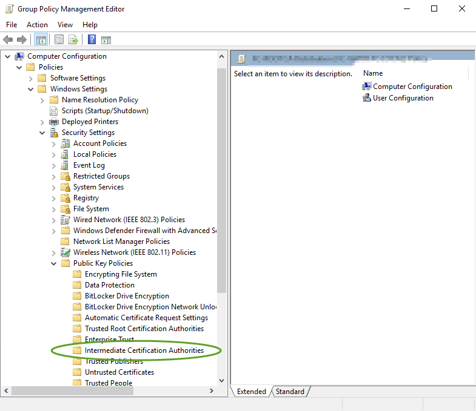
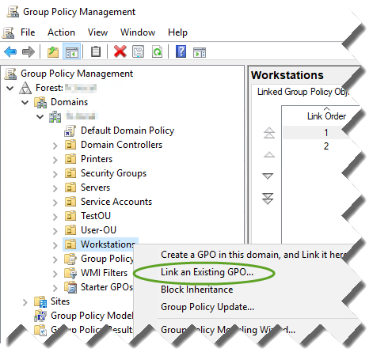
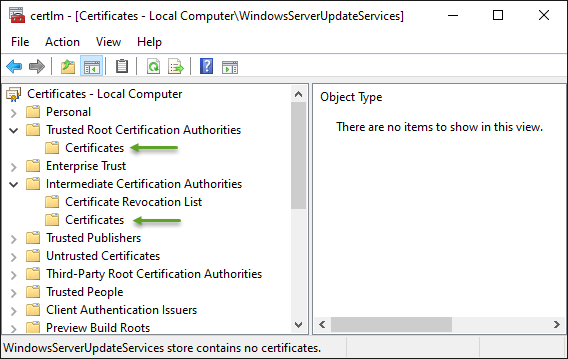
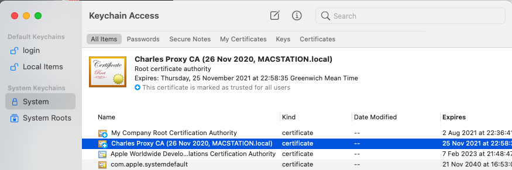

# Distributing the Certificates

Now we need to distribute the certificates to clients on the network such that when they connect to services in the cluster that have serving certificates signed by the intermediate CA, they will be trusted and the browsers won't complain.

First, gather the two CA certificates from the PKI server. Note that in both PKIs from the previous step, the certificates are called `ca.crt`. When you copy them off, be sure to rename as you copy them to e.g. `root-ca.crt` and `intermediate-ca.crt` so as not to confuse them when distributing.

Now jump to

* [Windows with Active Directory](#windows-with-active-directory)
* [Windows without Active Directory](#windows-without-active-directory)
* [Linux](#linux)
* [Mac](#mac)

## Windows with Active Directory

If you have an active directory on your network, the AD can easily distribute the certificates to all domain members via Group Policy.

### Create a Group Policy object

Here we create a GPO into which we import the two CA certificates. On the Active Directory server, or a machine with RSAT tools installed...

Copy the two certificates to this machine.

1. Open Group Policy Management tool
1. Expand your domain, right click on Group Policy Objects and select New

    
1. Give the GPO a meaningful name and click OK. It will appear in the list of Group Policy Objects
1. Right click on the newly created GPO and select `Edit`.
1. Under `Computer Configuration`, navigate to `Policies/Windows Settings/Security Settings/Public Key Polices`

### Import Root CA certificate

1. Select `Trusted Root Certification Authorities`, and in the right hand pane, right click and select `Import`, then click `Next` in the first dialog.

    
1. For the `File name`, browse to where you have placed the Root CA certificate file
1. Click Next, and click Next again. The certificate will be imported.

### Import Intermediate CA certificate

1. In the left pane of the GPO editor, select `Intermediate Certification Authorities`and in the right hand pane, right click and select `Import`, then click `Next` in the first dialog.

    
1. For the `File name`, browse to where you have placed the Intermediate CA certificate file
1. Click Next, and click Next again. The certificate will be imported.

Now you can close the GPO editor.

### Distribute

1. In the main Group Policy Management window, find the OU (or OUs) that contain the computers to which you want to distribute the certificates.
1. For each OU that contains machines you want to distribute to, right click the OU and select `Link an Existing GPO`.

    
1. Select your new GPO from the list.

Next time the computers in these OUs refresh group policy, they will receive copies of the certificates. You can of course run `gpupdate` at one of the domain computers to receive the certs immediately.

## Windows without Active Directory

Without AD, you have to import the certificates manually at each workstation you want them installed to, so at each workstation, copy the two `.crt` files onto it then:

In the Windows search bar, type `certlm.msc`. It will ask for Administrator permission. If you're not using an account with local admin rights, you'll have to enter an account the does.

### Import Root CA certificate

1. From the tree control in the left pane, expand `Trusted Root Certification Authorities`, right click on `Certificates`, select `All Tasks`, then `Import`, then click `Next` in the first dialog.
1. For the `File name`, browse to where you have placed the Root CA certificate file
1. Click Next, and click Next again. The certificate will be imported.

### Import Intermediate CA certificate

1. In the left pane of the certificate manager, expand `Intermediate Certification Authorities`, right click on `Certificates`, select `All Tasks`, then `Import`, then click `Next` in the first dialog.
1. For the `File name`, browse to where you have placed the Intermediate CA certificate file
1. Click Next, and click Next again. The certificate will be imported.

## Linux

For Linux hosts, we have to do this individually at each machine. You could create an Ansible job to do that, but it is beyond the scope of this tutorial.

1. Become `root`
1. Ensure you have the `ca-certificates` package present. If not, then install using the package manager for your distro.
1. Locate the certificate store for your distro (note RHEL includes compatibles like CentOS, Fedora, Amazon Linux etc.)
    | Distro | Directory|
    |--------|----------|
    | RHEL  < 7 | `/usr/local/share/ca-certificates` |
    | RHEL >= 7 | `/etc/pki/ca-trust/source/anchors` |
    | Debian/Ubuntu | `/usr/local/share/ca-certificates` |
1. Copy the two certificates to the certificate store as determined above. Make sure there are no certificates with the same filename as yours, or you will overwrite the originals (unless of course they are yours and are previous versions of the same certs)!
1. Update the store
    * RHEL - `update-ca-trust`
    * Debian - `update-ca-certificates`

## Mac

1. Copy the two certificates onto the Mac
1. Open the Keychain app
1. Navigate to System/Certificates
1. Import the certificates and select the `Always Trust` option.

Next: [Install cert-manager](./03-cert-manager.md)